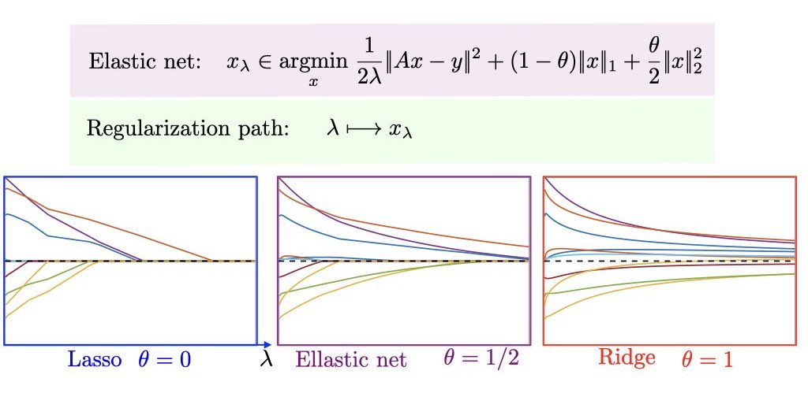

# Regression and Tree-based Methods

- [Regression](#Regression)
- [Tree-based Methods](#Tree-based-Methods)

## Regression

### 1. Least squares regression:

$$ RSS = \sum_{i=1}^n(y_{i} - \beta_{0} - \sum_{j-0}^p\beta_{j}x_{ij})^2 $$

residual sum of squares(RSS)

### 2. LASSO regression

LASSO: least absolute shrinkage and selection operator.

$$ RSS + \lambda\sum_{j-0}^p|\beta_{j}| $$

$l_{1}$ penalty

the lasso performs **variable selection**.

### 3. Ridge regression

$$ RSS + \lambda\sum_{j-0}^p\beta_{j}^2 $$

where $\lambda \geq 0$ is a *tuning parameter*.

$\sum_{j-0}^p\beta_{j}x_{ij}^2$, *shrinkage penalty*, $l_{2}$ penalty. 

the ridge includes all **p** predictors in the final model.

### 4. Elastic net regularization

## Tree-based Methods

### 1. bagging:

bootstrap

$$ \hat f_{bag}(x) = \frac{1}{B}\sum_{b=1}^B \hat f^{*b}(x) $$

### 2. random forests

*a random sample of m predictors* is chosen as split candidates from the full set of p predictors. 

### 3. boosting

Boosting works in a similar way, except that the trees are grown **sequentially**: each tree is grown using information from previously grown trees.

- In **bagging**, the trees are grown **independently** on random samples of the observations. Consequently, the trees tend to be quite **similar** to each other. Thus, bagging can get caught in **local optima** and can fail to thoroughly explore the model space.
- In **random forests**, the trees are once again grown independently on random samples of the observations. However, each split on each tree is performed using **a random subset of the features**, thereby **decorrelating** the trees, and leading to a more thorough exploration of model space relative to bagging.
- In **boosting**, we only use the original data, and do not draw any random samples. The trees are grown **successively**, using a “slow” learning approach: each new tree is fit to the signal that is left over from the earlier trees, and shrunken down before it is used.

